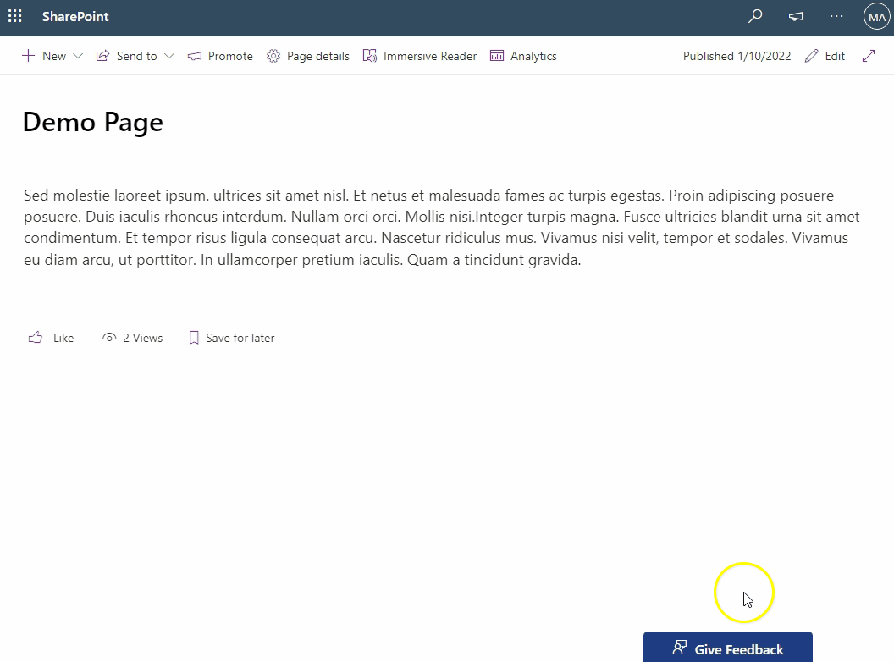
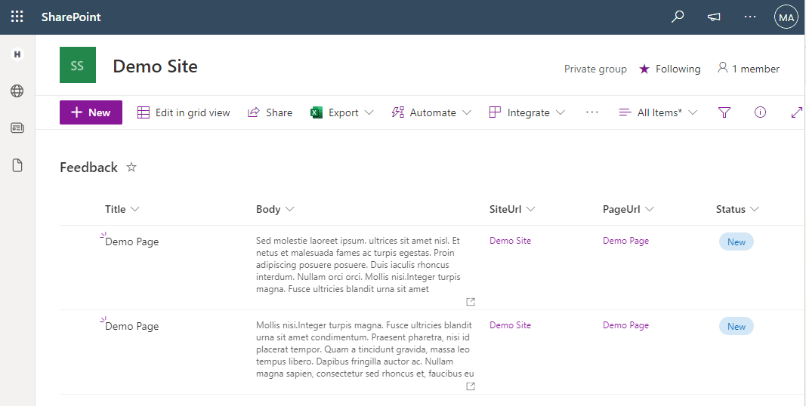
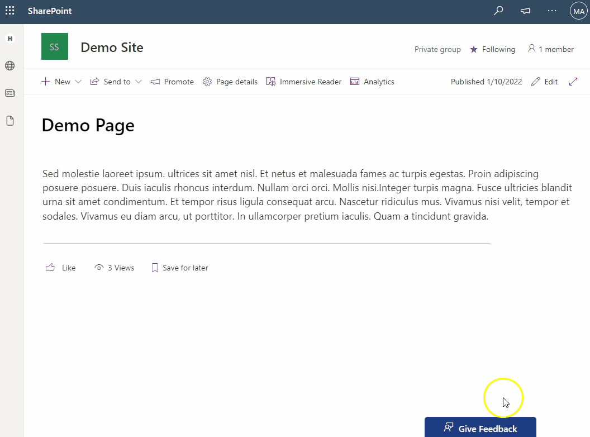

# Extension Collect Feedback

## Summary

The feedback extensions allows the end user to add feedback for the site where this extension has been installed on. It will add a button to all pages in the site. Clicking the button will open a panel that show the Site URL and Page URL and a textbox for entering feedback for the current page. 

### Why do you need this extension

When you deliver a new application within SharePoint Online, you want to collect feedback. The most simple way to do that is creating a list and allow all people in the site to enter information. However, you want to know the site and/or page people are visiting and providing feedback on. This web part assembles this information and stores it in the list together with the feedback. Easy, no rocket science, everybody understands it...

## Used SharePoint Framework Version

## Applies to

- [SharePoint Framework](https://aka.ms/spfx)
- [Microsoft 365 tenant](https://docs.microsoft.com/en-us/sharepoint/dev/spfx/set-up-your-developer-tenant)

## Feedback List

The list is a straightforward SharePoint list that is automatically created after the first time the feedback button is clicked. Make sure that when you install the extension, you create once (as an admin) on the button to create the list. Visitors will not be allowed to create lists on the site. They will receive a nice error message when the list does not exist.

As you can see in the image below the list contains of the following columns. The must exist, you can change whatever you want on the (for instance) `Status` field, sort order or grouping, as long as the following fields exists.

Field | Type | Remarks
----- | ---- | -------
Title | Single line of Text | Default title field in the list
Body | Multiline Textfield
SiteUrl | Hyperlink
PageUrl | Hyperlink
Status | Choice | At least status `New` should be present

## Creating the list

There are not special needs for the extension. If the Feedback list does not exist, it will be created. 

However the permissions for the list will not be changed. You have to do this by hand:
1. Open the list
2. Choose Gear Icon > Library Settings > Library Permissions
3. Break the role inheritance
4. Add persmission level `Contribute` to the Visitors group

## Solution

Solution|Author(s)
--------|---------
ExtFeedback | Maarten van den Dungen, Rapid Circle

## Version history

Version|Date|Comments
-------|----|--------
0.1|January 10, 2022|Initial release

## Disclaimer

**THIS CODE IS PROVIDED *AS IS* WITHOUT WARRANTY OF ANY KIND, EITHER EXPRESS OR IMPLIED, INCLUDING ANY IMPLIED WARRANTIES OF FITNESS FOR A PARTICULAR PURPOSE, MERCHANTABILITY, OR NON-INFRINGEMENT.**

---

## Minimal Path to Awesome

- Clone this repository
- Ensure that you are at the solution folder
- in the command-line run:
  - **npm install**
  - **gulp serve**

## References

- [Getting started with SharePoint Framework](https://docs.microsoft.com/en-us/sharepoint/dev/spfx/set-up-your-developer-tenant)
- [Building for Microsoft teams](https://docs.microsoft.com/en-us/sharepoint/dev/spfx/build-for-teams-overview)
- [Use Microsoft Graph in your solution](https://docs.microsoft.com/en-us/sharepoint/dev/spfx/web-parts/get-started/using-microsoft-graph-apis)
- [Publish SharePoint Framework applications to the Marketplace](https://docs.microsoft.com/en-us/sharepoint/dev/spfx/publish-to-marketplace-overview)
- [Microsoft 365 Patterns and Practices](https://aka.ms/m365pnp) - Guidance, tooling, samples and open-source controls for your Microsoft 365 development